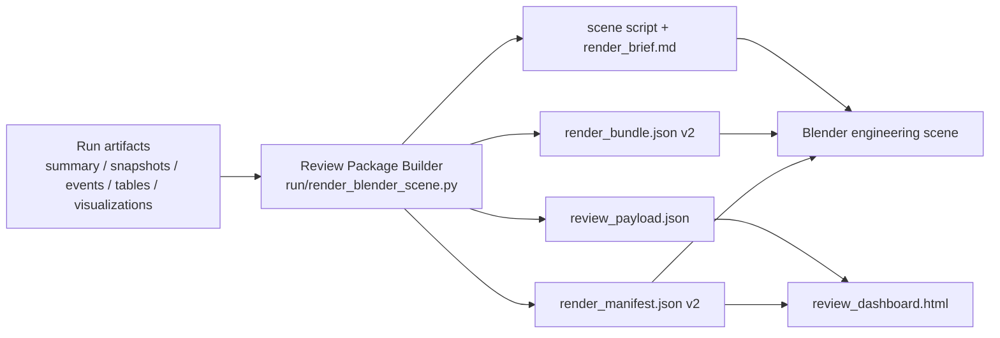

# R32 Blender Review Package 工程可视化升级总方案（2026-03-08）

## 1. 目的与边界

本文档用于把当前仓库已经批准的 Blender 可视化下一阶段方向正式冻结为可执行实施方案，供后续开发、验收、回归和汇报统一引用。本文档不是 setup note，不是宣传稿，也不是“已实现能力说明”；其职责是把下一阶段设计、边界、默认值、交付口径和验收标准一次性写死，避免后续推进过程中反复做产品决策。

本轮推进的原因有三点：
- 当前 `mass` / `vop_maas` 实验已经能稳定产出 `summary.json`、`snapshots/*.json`、`events/*.jsonl`、`tables/*.csv` 和多张可视化图，但这些资产还没有被组织成统一工程审阅包。
- 当前 Blender sidecar P0 只能完成 “final layout -> render bundle -> scene script -> brief -> optional direct render” 的单向导出，尚不足以支撑工程审阅。
- 当前主可视化图和 Blender 空间视图之间存在信息断裂：工程分析看趋势图，空间审阅看 3D 图，两者无法在同一交付中联查。

本方案服务对象的优先级固定如下：
1. **工程分析与审阅优先**
2. 对外展示、论文配图、汇报展示次之

本方案的非目标也固定如下：
- 不把 Blender 纳入 solver 内环，不参与约束判定、求解反馈和 strict gate；
- 不实现仓内自动 MCP client；
- 不把 STEP->mesh bridge 作为本阶段主线；
- 不在本阶段实现 full COMSOL 场云或高保真场分布可视化；
- 不引入需要 Node 构建链的前端主工程。

必须持续强调的边界是：**优化真值仍然来自 `LLM -> pymoo -> physics -> diagnosis` 主链，Blender Review Package 只是主链产物的单向消费与组织层。**

## 2. 当前真实实现现状

### 2.1 `core/visualization.py` 已有产物

当前仓库的 canonical 分析可视化入口仍是 `core/visualization.py`。它已经可以稳定生成以下分析型资产：
- `visualizations/final_layout_3d.png`
- `visualizations/layout_evolution.png`
- `visualizations/thermal_heatmap.png`
- `visualizations/mass_storyboard.png`
- `visualizations/mass_trace.png`
- `visualizations/layout_timeline.gif`
- `visualizations/timeline_frames/*.png`
- `visualizations/visualization_summary.txt`

这些资产能够支撑：
- final layout 的静态 3D 盒体视图；
- layout 变化趋势的静态摘要；
- thermal proxy 或 COMSOL 驱动下的热图表达；
- mass / attempt / policy / observability 事件汇总；
- timeline 帧图与 GIF 回放。

### 2.2 Blender sidecar P0 已有能力

当前 Blender 相关仓内实现主要位于：
- `visualization/blender_mcp/contracts.py`
- `visualization/blender_mcp/bundle_builder.py`
- `visualization/blender_mcp/codegen.py`
- `visualization/blender_mcp/brief_builder.py`
- `run/render_blender_scene.py`

当前真实能力边界是：
- 能从某个 run 目录读取 `summary.json` 与 final snapshot；
- 能生成 `render_bundle.json`；
- 能生成 Blender scene script；
- 能生成面向 Codex + Blender MCP 的 `render_brief.md`；
- 在本地有 Blender 可执行文件时，可选 direct render。

当前仓库 **尚未** 实现的能力包括：
- 标准化三态 scene（`initial / best / final`）；
- 伴随 `review_payload.json`；
- 自包含离线 `review_dashboard.html`；
- 升级版 `render_manifest.json v2`；
- 稳定的 Blender review package 常规产出链。

### 2.3 当前实验目录的真实消费形态

从最近的 `experiments/` 目录看，常见稳定产物仍然是：
- `report.md`
- `summary.json`
- `events/*.jsonl`
- `tables/*.csv`
- `visualizations/*.png`
- `visualizations/*.gif`

也就是说，当前实验产物的主流消费口径仍然是 “报告 + 表格 + PNG/GIF”，而不是标准化 Blender 工程审阅包。

## 3. 现状问题诊断

### 3.1 `final_layout_3d.png` 有空间感，但工程表达不足

当前 `final_layout_3d.png` 能快速展示最终布局，但存在几个明确问题：
- 以静态单视角为主，缺少工程审阅常用的状态切换与结构切换；
- 组件标签密度上升时容易遮挡；
- 无法直接联查该布局对应的 `best_cv`、`release_audit`、`operator_actions`、`dominant_violation` 等诊断上下文；
- 对 keepout / envelope / proxy attachment 的信息表达仍然偏弱。

### 3.2 `mass_trace` / `mass_storyboard` 信息密集，但与空间断裂

`mass_trace.png` 与 `mass_storyboard.png` 已经能承载：
- generation/attempt 趋势；
- observability funnel；
- policy 与 physics 事件摘要；
- release audit 关键字段。

但它们的问题不是信息不足，而是**与空间视图完全脱节**：
- 看图能知道哪次 attempt 出问题，但看不到它对应的空间状态；
- 看得到 operator family 覆盖，却看不到组件到底如何移动；
- 看得到 `no_feasible` 或 `dominant_violation`，却不能直接切到对应场景审阅。

### 3.3 timeline 当前是“帧图 + GIF”，缺少结构化联查

当前 timeline 已经比单张图更进一步，但仍有三个不足：
- 本质仍然是离散帧序列 + GIF，而不是结构化工程 review surface；
- timeline 里的事件、指标、动作家族和状态切换缺少稳定 contract；
- 很难把它与 Blender scene 组合成统一交付资产。

### 3.4 Blender P0 是单向导出，不是工程审阅包

当前 Blender sidecar P0 的定位更接近：
- scene reconstruction helper；
- render preparation helper；
- MCP usage bridge。

它还不是：
- 可标准化复核的 run 审阅资产；
- 含空间+证据双视图的交付单元；
- 带 manifest / dashboard / three-state scene 的工程审阅包。

因此，当前问题的根本不在于“没有 3D”，而在于“没有统一审阅包”。

## 4. 外部调研结论

### 4.1 Blender MCP 的适用角色

调研结论：Blender MCP 更适合做 **交互式建场景、检查场景、补拍视图、与 Codex 协作驱动 Blender**，而不是承担高密度分析图面板。

- documented fact：`blender-mcp` 项目把 Blender 作为可由 MCP 工具远程驱动的场景环境，提供场景信息读取、执行 Blender 代码等能力  
  来源：[blender-mcp GitHub](https://github.com/ahujasid/blender-mcp)
- 本仓推断：这意味着 Blender MCP 很适合作为审阅过程中的“交互入口”，但不应成为高密度审计信息的唯一承载面。

### 4.2 Blender 官方 glTF 的适用角色

调研结论：Blender 官方 glTF 导出更适合作为 **Phase 2 的 web sharing bridge**，而不是本阶段的主入口。

- documented fact：Blender 官方 glTF 2.0 导入导出支持 `.glb` / `.gltf`，并能将自定义属性导出为 `extras`  
  来源：[Blender Manual - glTF 2.0](https://docs.blender.org/manual/en/latest/addons/import_export/scene_gltf2.html)
- 本仓推断：当 Blender 审阅面稳定后，glTF 很适合作为后续浏览器 viewer 的桥接格式。

### 4.3 Plotly 的适用角色

调研结论：Plotly 的 `write_html` 非常适合当前仓库需要的 **离线、自包含、无需前端构建链的 review dashboard**。

- documented fact：Plotly 官方 API 提供 `plotly.io.write_html`，可输出自包含 HTML  
  来源：[Plotly `write_html`](https://plotly.com/python-api-reference/generated/plotly.io.write_html.html)
- 本仓推断：这与本仓“Python 主导、不引入 Node 主工程、实验产物可直接归档”的需求高度匹配。

### 4.4 PyVista 的适用角色

调研结论：PyVista 的 HTML 导出是可行方案，但不是当前阶段最优路径。

- documented fact：PyVista 官方文档提供 `Plotter.export_html()` 用于导出 HTML 可视化  
  来源：[PyVista `export_html`](https://docs.pyvista.org/api/plotting/_autosummary/pyvista.Plotter.export_html.html)
- 本仓推断：PyVista 更适合以网格/体渲染为核心的三维可视化；而当前仓库已有 Blender sidecar P0 和 Matplotlib 分析图，优先级不如 Blender + Plotly 组合。

### 4.5 Three.js / glTF 的阶段性判断

调研结论：Three.js + glTF 是后续阶段可用的分发方案，但不应替代当前 Blender 主审阅面。

- documented fact：Three.js 官方 `GLTFLoader` 支持浏览器加载 glTF / glb 资产  
  来源：[Three.js GLTFLoader](https://threejs.org/docs/#examples/en/loaders/GLTFLoader)
- 本仓推断：它适合跨机器分享、论文补充材料和网页分发，但前提是本仓先把 review package contract 稳定下来。

## 5. 目标方案总览

### 5.1 总体思路

本轮目标方案冻结为：

> **Run artifacts -> Review Package -> Blender engineering scene + offline review dashboard**

它不是替换现有 `core/visualization.py`，而是在现有产物之上追加统一交付层。

### 5.2 文本架构图

### 5.3 方案原则

本方案的强制原则如下：
- review package 必须只消费 run 资产，不回写 solver 主链真值；
- Blender 与 dashboard 必须共享同一份 run truth；
- 3D 审阅和分析证据必须作为同一交付单元出现；
- `engineering` profile 默认优先于 `showcase`；
- 没有 Blender 环境时，review package 也应能产出除 direct render 之外的其他资产。

## 6. Review Package 合同设计

### 6.1 `render_bundle.json v2`

#### 职责
- 作为 Blender scene reconstruction 的 canonical handoff contract；
- 承载三态空间信息，而不只承载 final state；
- 承载 Blender 场景构建所需的最小几何、注释和审阅辅助信息。

#### 最小字段集

建议冻结以下顶层字段：
- `schema_version`
- `run_id`
- `run_label`
- `source`
- `units`
- `coordinate_system`
- `envelope`
- `keepouts`
- `key_states`
- `constraint_overlays`
- `component_annotations`
- `metrics`
- `render_profile`
- `heuristics`
- `artifact_links`
- `metadata`

其中：
- `key_states` 必须至少包含 `initial`、`best`、`final`
- 每个 state 至少包含：
  - `name`
  - `snapshot_path`
  - `stage`
  - `thermal_source`
  - `diagnosis_status`
  - `metrics`
  - `operator_actions`
  - `components`

#### 真值来源
- `initial`：首个 layout snapshot
- `best`：复用当前既有 best-state helper 选择逻辑
- `final`：优先 `final_selected`，缺失时退化为最后 snapshot
- `keepouts`：来自 `DesignState.keepouts`
- `metrics`：来自 `summary.json`、snapshot `metrics` 及补充聚合

#### 向后兼容策略
- `v1` 读取仍可保留，只承载 final state
- `v2` 是新默认写出格式
- 后续实现必须允许从 `v1` 退化读取，但仓内新生成资产默认写 `v2`

### 6.2 `review_payload.json`

#### 职责
- 作为 dashboard 的 canonical data contract；
- 汇总 run 级审阅所需的非空间结构化数据；
- 避免 dashboard 直接散读多个 CSV/JSON 文件。

#### 最小字段集
- `schema_version`
- `run`
- `summary`
- `release_audit`
- `states`
- `attempt_trends`
- `generation_trends`
- `operator_coverage`
- `layout_displacement`
- `timeline`
- `artifacts`
- `notes`

#### 真值来源
- `summary`：`summary.json`
- `release_audit`：`tables/release_audit.csv`
- `attempt_trends`：`mass_trace.csv` / `tables/attempts.csv`
- `generation_trends`：`tables/generations.csv`
- `operator_coverage`：`tables/policy_tuning.csv`、`events/policy_events.jsonl`
- `layout_displacement`：`snapshots/*.json`、`tables/layout_timeline.csv`
- `timeline`：`events/layout_events.jsonl`
- `artifacts`：现有 `visualizations/*.png|gif`、Blender 侧输出路径

#### 向后兼容策略
- 这是新增 contract，无历史兼容负担；
- v1 需要字段尽量克制，避免把所有原始表复制进去；
- dashboard 只依赖 `review_payload.json`，不依赖后续新增字段才能工作。

### 6.3 `render_manifest.json v2`

#### 职责
- 记录 review package 的生成结果、路径和 sidecar 执行状态；
- 成为 run 级 Blender/review 资产的总索引；
- 明确 direct render 是否成功，不把它混入 solver status。

#### 最小字段集
- `status`
- `run_dir`
- `bundle_path`
- `scene_script_path`
- `brief_path`
- `review_payload_path`
- `review_dashboard_path`
- `source_snapshot_paths`
- `output_image_paths`
- `output_blend_path`
- `profile_name`
- `key_states`
- `direct_render_status`
- `direct_render_stdout`
- `direct_render_stderr`
- `metadata`

#### 真值来源
- 由 review package builder 在单次执行中统一写出

#### 向后兼容策略
- 保留旧 manifest 字段；
- 新字段追加，不删除旧字段；
- `direct_render_status` 的语义维持 sidecar-only，不与 run status 混淆。

## 7. Blender 工程审阅面设计

### 7.1 Collection 组织

Blender scene 的默认 collection 组织冻结为：
- `MSGA_Envelope`
- `MSGA_Keepouts`
- `MSGA_State_Initial`
- `MSGA_State_Best`
- `MSGA_State_Final`
- `MSGA_Attachments`
- `MSGA_Annotations`

默认只显示 `MSGA_State_Final`，其余 collection 用于人工切换和比对。

### 7.2 `engineering` profile 默认视图

`engineering` profile 的默认目标不是“更好看”，而是“更可审阅”。默认表达规则固定如下：
- envelope 使用半透明工程外壳；
- keepout 使用高对比可见体；
- 组件按 category 或 role 着色；
- moved components 与 top-N 关键组件显示 label；
- proxy attachment 与真实组件使用明显不同的材质或线框表达；
- 尽量减少会遮挡工程阅读的装饰性灯光和外观件。

### 7.3 三态切换规则

三态切换必须固定为：
- `initial`：首个 snapshot
- `best`：复用既有 best-state helper
- `final`：`final_selected` 优先，否则最后 snapshot

禁止在 Blender review package 中重新定义一套“best”排序逻辑。

### 7.4 keepout / envelope / moved components / proxy attachments 的可视表达

- keepout：必须可独立开关，并与 envelope 明显区分
- envelope：必须可独立开关，并作为空间边界参照
- moved components：必须可做重点标注，不要求全量文字铺满
- proxy attachments：必须与 solver 真值组件区分显示，并在 manifest / brief 中声明 visualization-only 语义

### 7.5 `showcase` 的定位

`showcase` 只作为增强 profile：
- 可加强灯光、材质、镜头和 turntable；
- 可引入更多演示导向的视觉风格；
- 但不能覆盖、替代或污染 `engineering` 的主审核口径。

## 8. 伴随 Dashboard 设计

### 8.1 页面必须包含的板块

`review_dashboard.html` 至少包含以下板块：
- run summary
- release audit
- attempt trends
- generation trends
- operator coverage
- layout displacement
- timeline gallery
- artifact links

可选补充：
- dominant violation summary
- best-state vs final-state 对比摘要
- visualizations 现有 PNG/GIF 嵌入

### 8.2 Dashboard 的技术形态

本阶段 dashboard 的技术形态固定为：
- Python 直接生成
- 自包含离线 HTML
- 可归档进 run 目录
- 不依赖 Flask 服务在线运行
- 不依赖 Node / Vite / Webpack 前端打包

### 8.3 Dashboard 与 run 资产的关系

dashboard 不应直接在运行时散读所有原始表，而应优先消费 `review_payload.json`。这样做的目的有三点：
- 固定 contract；
- 降低页面与底层表结构的耦合；
- 方便后续加入 web viewer 或 API 暴露而不改变数据语义。

## 9. CLI 与目录布局

### 9.1 主入口

默认主入口固定为：

`run/render_blender_scene.py`

后续扩展参数的默认方向固定为：
- `--run-dir`
- `--output-dir`
- `--profile engineering|showcase`
- `--key-states initial,best,final`
- `--emit-review-package`
- `--render-direct`
- `--blender-exe`

### 9.2 标准输出目录

review package 标准目录固定为：

`<run-dir>/visualizations/blender/`

标准输出文件建议固定为：
- `render_bundle.json`
- `review_payload.json`
- `render_manifest.json`
- `render_brief.md`
- `review_dashboard.html`
- `blender_scene_builder.py`
- `final_satellite_scene.blend`
- `engineering_iso.png`
- `engineering_top.png`
- `engineering_front.png`
- `showcase_turntable.mp4` 或后续等价资产（若实现）

### 9.3 与现有 run 目录的关系

review package 不替代现有：
- `summary.json`
- `events/`
- `tables/`
- `visualizations/*.png|gif`

它的职责是把这些既有工件重新组织成统一工程审阅包，并补充 Blender scene 与离线 dashboard。

## 10. 分阶段实施路线

### Phase 1：contract + manifest + payload

#### 目标
- 冻结 `render_bundle.json v2`
- 冻结 `review_payload.json`
- 冻结 `render_manifest.json v2`

#### 输入
- `summary.json`
- `snapshots/*.json`
- `events/layout_events.jsonl`
- `tables/*.csv`
- 现有 `visualizations/*.png|gif`

#### 输出
- contract 定义
- builder 逻辑
- manifest 写出逻辑

#### DoD
- 无 Blender 环境也能生成 bundle/payload/manifest
- contract 字段稳定
- 缺失 `final_selected` 时有固定退化规则

#### 验收点
- 同一 run 多次生成字段一致
- state 选择与现有真值口径一致

### Phase 2：三态 Blender engineering scene

#### 目标
- 生成 `initial / best / final` 三态 Blender scene
- 加入 keepout / envelope / annotation collection

#### 输入
- `render_bundle.json v2`

#### 输出
- 三态 scene script
- Blender collection 组织
- 工程 profile stills

#### DoD
- Blender 打开后可切换三态 collection
- keepout / envelope / moved components 可独立审阅

#### 验收点
- scene 中组件数量、ID、位置与 source snapshots 一致
- proxy attachments 被清晰标记为 visualization-only

### Phase 3：review dashboard

#### 目标
- 生成离线 `review_dashboard.html`

#### 输入
- `review_payload.json`

#### 输出
- 自包含 HTML dashboard

#### DoD
- 单文件离线可打开
- 可读 run summary / release audit / trend / gallery / artifacts

#### 验收点
- 不依赖 Flask / 前端构建
- 与 manifest 链接一致

### Phase 4：direct render / MCP 协同

#### 目标
- 让 direct Blender render 与 Codex + Blender MCP brief 协同工作

#### 输入
- scene script
- manifest
- brief

#### 输出
- direct render stills
- 更完整的 MCP brief

#### DoD
- 有 Blender 时可直接产图
- 无 Blender 时仍保留完整 review package 元数据

#### 验收点
- direct render 失败只写 manifest warning
- 不影响 solver / run status

### Phase 5：README / HANDOFF / API 轻联动

#### 目标
- 将 review package 作为新批准方向纳入对外口径

#### 输入
- 已冻结的 contract 与 artifact 命名

#### 输出
- 文档更新
- 必要时 API 链接补充

#### DoD
- `HANDOFF` / `README` / ADR / report 口径一致
- API 若联动，仅暴露已有资产，不引入第二真值源

#### 验收点
- 文档不超前声明
- API 联动不改变现有主运行路径

## 11. 测试与验收标准

### 11.1 Contract tests

必须覆盖：
- `render_bundle.json v2` 字段完整性
- `review_payload.json` 字段完整性
- `render_manifest.json v2` 路径与状态字段完整性
- 缺失可选工件时的退化行为

### 11.2 CLI smoke

至少选两个现有 run 做 smoke：
- 一个较轻量 run
- 一个包含较完整 `tables/events/visualizations` 的 run

需要验证：
- 无 Blender 时仍能生成 review package 核心文件
- 有 Blender 时可补充 still / blend 输出

### 11.3 Artifact integrity checks

需要验证：
- manifest 引用路径存在
- bundle / payload / dashboard / brief 之间互相链接一致
- key states 来源路径可追溯

### 11.4 Blender scene acceptance

需要验证：
- 三态切换正常
- keepout / envelope 可见
- moved components 标注清晰
- proxy objects 与真实组件区分明显

### 11.5 Dashboard acceptance

需要验证：
- 离线 HTML 可打开
- 首屏可见 run summary 与 release audit
- trend / gallery / artifact links 可正常使用

### 11.6 Non-regression scope

必须明确：
- 现有 `core/visualization.py` 输出不能回退
- 现有 `run/render_blender_scene.py` P0 路径不能被破坏
- Blender sidecar failure 不能污染 solver success semantics

## 12. 风险、默认值与后续路线

### 12.1 风险

#### label 过载风险
- 如果在 Blender 中放太多文字与指标，工程 scene 会迅速变成“信息糊墙”
- 缓解策略：高密度分析信息放 dashboard，Blender 只保留空间相关重点注释

#### best-state 口径漂移风险
- 如果 review package 另起一套 best-state 逻辑，会与 release audit 口径打架
- 缓解策略：必须复用现有 helper，不新造排序规则

#### heuristic 误读为真值风险
- solar wings、lens、attachment 等 visualization-only 元素可能被误读为 solver 真值
- 缓解策略：scene、brief、manifest 三处都要显式声明 visualization-only

#### Plotly 新依赖风险
- 引入 Plotly 会带来新依赖与版本管理需求
- 缓解策略：固定版本、限定用途为离线 HTML dashboard、避免引入前端构建链

### 12.2 默认值

本报告冻结以下默认决定：
- 默认主入口：`run/render_blender_scene.py`
- 默认 profile：`engineering`
- 默认 state set：`initial,best,final`
- 默认 dashboard 形态：离线 HTML
- 默认触发方式：显式 CLI，不进 strict post-run hook
- 默认 best-state 选择：复用现有 helper，不新造排序逻辑

### 12.3 后续路线

当以下条件满足时，可考虑进入下一阶段：
- review package contract 稳定；
- Blender engineering scene 稳定；
- dashboard 被实际团队审阅流程接受；
- manifest 与 artifact 命名冻结。

达到上述条件后，Phase 2+ 可考虑：
- Blender -> glTF 导出
- Three.js web viewer sidecar
- 更丰富的 showcase render
- 选定组件的 STEP->mesh bridge

但这些都必须建立在本报告定义的 review package 先落稳的前提上。
